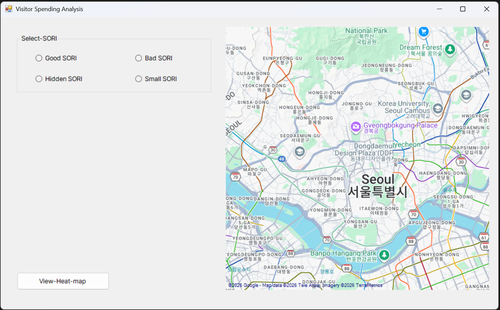
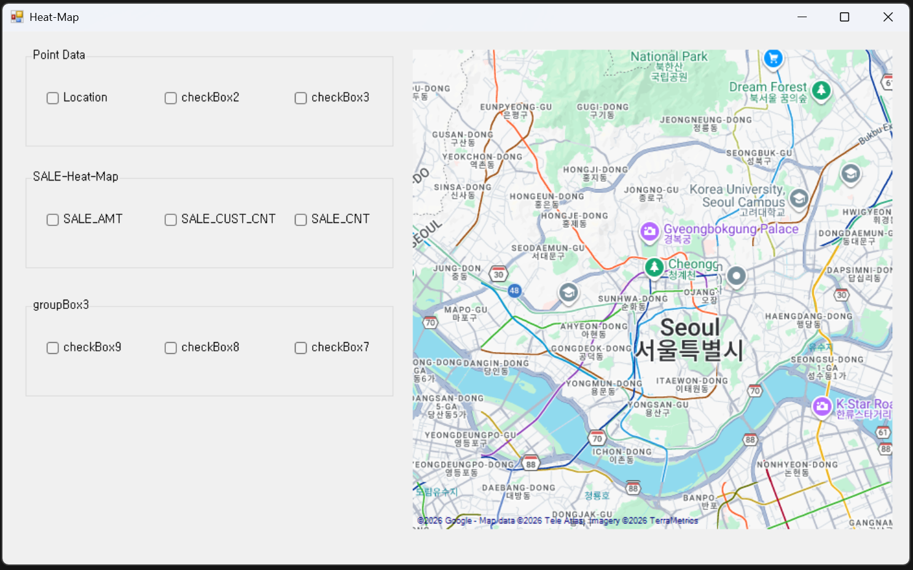
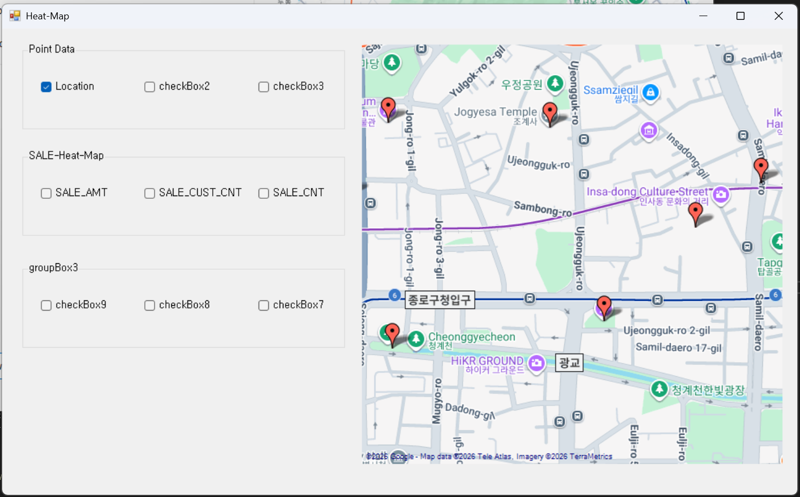
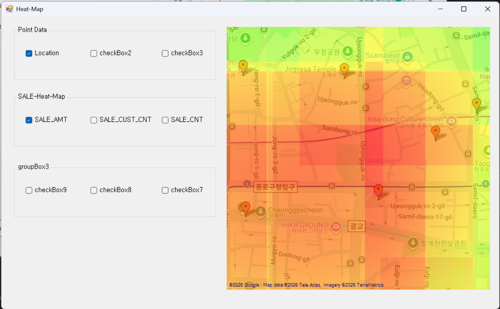

# GIS Heatmap Application
 

  <a href="#english">English</a> &nbsp;|&nbsp;
  <a href="#korean">한국어</a>

<h2 id="english">🇺🇸 English</h2>
 
### Project Purpose & Notes
 
This project is a prototype designed to implement the workflow of geocoding tourist data and integrating it into a map-based Windows Forms application.
 
The primary focus is on how spatial data can be processed, connected, and visualized within an application environment.
 
UI components were designed with scalability in mind, allowing for future feature expansion depending on data availability and quality. Due to limitations in data acquisition, some features remain partially implemented.
 
This is a development-oriented prototype aimed at validating spatial data processing and visualization workflows, rather than a fully completed application.
 
### Features
 
- Map-based visualization
- Marker display for geocoded tourist locations
- Heatmap generation based on sales data
### How to Run
 
1. Run the application 
   
2. Click **View Heat Map** to open the second form 
   
3. Select a location to display geocoded tourist point data on the map 
   
4. In the **Sale** group box, select a metric to visualize the heatmap (e.g. `Sale_AMT`) 
   
### Tech Stack
 
- C# / Windows Forms
- GMap.NET
### Data
 
- `sample.csv` — Seoul tourist location sales data
- Heatmap is generated based on location coordinates and sales values

<h2 id="korean">🇰🇷 한국어</h2>
 
### 프로젝트 목적 및 참고사항
 
본 프로젝트는 관광지 데이터의 지오코딩 처리와, 해당 데이터를 Windows Forms 기반 지도 UI에 연동하여 시각화하는 과정을 구현하기 위한 프로토타입입니다.
 
공간 데이터를 실제 애플리케이션 환경에서 어떻게 연결하고 표현할 수 있는지에 초점을 맞추어 개발되었습니다.
 
샘플 데이터의 양과 품질에 따른 기능 확장을 고려하여 다양한 UI 요소를 사전에 설계하였으며, 현재는 데이터 확보의 한계로 일부 기능은 추가 구현 단계에 있습니다.
 
본 프로젝트는 완성형 서비스가 아닌, 공간 데이터 처리 및 시각화 흐름을 검증하기 위한 개발 과정 중심의 결과물입니다.
 
### 주요 기능
 
- 지도 기반 시각화
- 관광지 위치 마커 표시
- 매출 데이터 기반 히트맵 생성
### 실행 방법
 
1. 프로그램 실행 
   
2. **View Heat Map** 클릭 시 두 번째 폼으로 이동 
   
3. location 선택 시 지오코딩된 관광지 포인트 데이터를 지도에서 확인 
   
4. **Sale** 그룹 박스에서 히트맵 확인 (예: `Sale_AMT`) 
   
### 기술 스택
 
- C# / Windows Forms
- GMap.NET
### 데이터 설명
 
- `sample.csv` — 서울 관광지 매출 데이터
- 위치 정보와 매출 값을 기반으로 히트맵 생성
